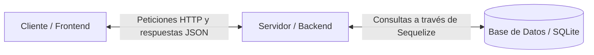

# 2. Arquitectura del Sistema

Este documento explica cómo está estructurado el código de **FreelanceFlow CRM** y cómo se comunican las diferentes partes de la aplicación. Está diseñado para que cualquier persona con conocimientos básicos de desarrollo web pueda comprender el flujo de trabajo.

---

## 1. Modelo Cliente-Servidor (La Arquitectura General)

El sistema se divide estrictamente en dos mundos o partes que cooperan entre sí:



### 1.1 El Cliente (Frontend - En la carpeta `/frontend`)
Es la interfaz visual con la que interactúa el usuario. Está construida usando **tecnologías web estándar (Vanilla HTML, CSS y JavaScript)**:
*   No utiliza frameworks complejos (como React, Angular o Vue), lo que garantiza que la página sea ligera y rápida de cargar.
*   Su único propósito es dibujar la interfaz en la pantalla del usuario, validar que los datos que introduce el usuario tengan un formato correcto (por ejemplo, que un correo electrónico tenga un `@`) y enviar las solicitudes al servidor.

### 1.2 El Servidor (Backend - En la carpeta `/backend`)
Es el motor del sistema. Se encarga de procesar los datos y proteger la información:
*   Está construido con **Node.js** y **Express.js**.
*   Funciona como una **API RESTful**. Esto significa que es un canal de comunicación que recibe las peticiones del frontend (ej. *"dame los proyectos de este usuario"*), procesa los datos correspondientes y responde con la información en formato **JSON** (un formato de texto estructurado muy fácil de leer por JavaScript).
*   Se comunica con la base de datos local **SQLite** (a través de un intermediario llamado ORM Sequelize) para guardar y leer los registros.

---

## 2. Estructura de Carpetas del Proyecto

El código fuente del proyecto se organiza de la siguiente manera para mantener el orden y separar responsabilidades:

```text
/ProyectoFreelanceCRM_02 (Raíz del repositorio)
│
├── /Documentación            # Documentación completa del proyecto (este directorio)
│
├── /frontend                 # Interfaz visual y código del lado del cliente
│   ├── index.html            # Pantalla de Login (punto de entrada)
│   ├── /pages                # Vistas internas (dashboard, clientes, proyectos, tareas)
│   ├── /css                  # Hojas de estilo estructuradas en archivos específicos
│   │   ├── style.css         # Estilos globales y reseteo base de diseño
│   │   ├── variables.css     # Paleta de colores, fuentes tipográficas y tamaños
│   │   ├── auth.css          # Estilos específicos para la pantalla de inicio de sesión
│   │   └── dashboard.css     # Estilos de la barra lateral, tablas y cuadrículas
│   └── /js                   # Lógica e interacción de las pantallas
│       ├── auth.js           # Validación y proceso de inicio de sesión
│       ├── clients.js        # Lógica para mostrar, crear y editar clientes
│       ├── projects.js       # Lógica para gestionar proyectos y cargar clientes
│       └── dashboard.js      # Protección de rutas y carga de métricas iniciales
│
└── /backend                  # Servidor, lógica de negocio y base de datos
    ├── database.sqlite       # Archivo físico de la base de datos SQLite
    ├── package.json          # Lista de dependencias del servidor (librerías instaladas)
    ├── .env                  # Configuración segura de variables de entorno (contraseñas internas)
    └── /src                  # Código fuente del servidor
        ├── app.js            # Archivo principal de entrada que arranca el servidor
        ├── /config           # Configuración de la base de datos
        ├── /controllers      # Lógica de respuesta (qué hacer cuando se piden clientes o proyectos)
        ├── /models           # Definición de las tablas de la base de datos con Sequelize
        ├── /routes           # Rutas del servidor (mapea URLs a sus respectivos controladores)
        └── /utils            # Scripts adicionales (por ejemplo, el inyector de datos de prueba)
```

---

## 3. ¿Cómo se comunican el Frontend y el Backend?

Dado que el frontend y el backend están separados, se comunican a través de **Peticiones HTTP (Fetch API)**. Cuando el usuario realiza una acción en la pantalla, ocurre lo siguiente:

1.  **Evento:** El usuario hace clic en "Guardar Cliente".
2.  **Petición (Request):** El archivo `clients.js` recolecta los datos del formulario y realiza una petición HTTP (usualmente de tipo `POST` o `PUT`) hacia el backend en `http://localhost:3000/api/clients`.
3.  **Procesamiento:** El servidor Express recibe la petición en `app.js`, la redirige mediante las rutas (`clientRoutes.js`) al controlador (`clientController.js`). El controlador valida los datos, le pide al modelo (`Client.js`) que guarde la información en SQLite y recibe la confirmación.
4.  **Respuesta (Response):** El controlador responde al frontend enviando los datos del nuevo cliente en un JSON con un código de estado exitoso (ej. `201 Created`).
5.  **Actualización Visual:** El frontend recibe la respuesta del servidor y, usando JavaScript nativo, actualiza la tabla de clientes en pantalla sin necesidad de recargar toda la página web.

---

## 4. Tecnologías Clave Explicadas de Forma Sencilla

*   **HTML5 y CSS3:** El esqueleto y la ropa de la aplicación. Le dan estructura y un diseño visual atractivo y adaptativo.
*   **Vanilla JavaScript (JS puro):** El cerebro del cliente. Se encarga de hacer peticiones de datos en segundo plano y de cambiar el contenido de la pantalla dinámicamente.
*   **Node.js:** El entorno que permite ejecutar JavaScript en el servidor (fuera del navegador).
*   **Express.js:** Una herramienta de Node.js que facilita la creación de rutas web y el procesamiento de peticiones HTTP en el servidor.
*   **Sequelize (ORM):** Un traductor que nos permite comunicarnos con SQLite usando objetos JavaScript comunes en lugar de escribir consultas SQL.
*   **SQLite:** Una base de datos ultraligera que se guarda en un solo archivo físico local (`database.sqlite`), por lo que no requiere instalar motores pesados como PostgreSQL o MySQL para desarrollo.
