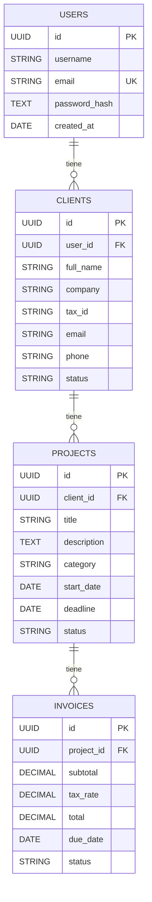

# 3. Modelado de Datos

Este documento describe la estructura y diseño de la base de datos de **FreelanceFlow CRM**. Aquí se explica de manera clara cómo se guarda la información, qué tipos de datos se utilizan y cómo están relacionadas las tablas del sistema.

---

## 1. Diseño General (Modelo Entidad-Relación)

La base de datos del sistema es relacional. Esto significa que la información está organizada en tablas separadas, pero conectadas entre sí mediante campos clave (llamados **claves foráneas** o *foreign keys*).

El flujo de relaciones es el siguiente:
1.  Un **Usuario (User)** es el freelancer. Este usuario tiene registrados a múltiples **Clientes (Client)**.
2.  Cada **Cliente (Client)** puede tener asignados varios **Proyectos (Project)**.
3.  Cada **Proyecto (Project)** puede tener múltiples **Cobros/Facturas (Invoice)** asociados.

---

## 2. Explicación de los Conceptos Técnicos

*   **UUID (Identificador Único Universal):** En lugar de usar números simples y secuenciales para el ID de los registros (como 1, 2, 3...), se utiliza UUID. Este es un código de texto largo generado al azar (por ejemplo: `d3b07384-d113-4956-a5d2-f47287d3e231`). Esto evita colisiones de datos y mejora la seguridad, haciendo imposible adivinar los IDs de otros registros.
*   **Clave Primaria (PK - Primary Key):** Es el campo único que identifica de forma absoluta a cada fila de una tabla. No se puede repetir.
*   **Clave Foránea (FK - Foreign Key):** Es un campo en una tabla que hace referencia a la clave primaria de otra tabla, creando una conexión entre ambas.
*   **Tipos de Datos Usados:**
    *   `UUID`: Un identificador de texto único universal.
    *   `STRING(X)`: Texto corto de hasta X caracteres (ej. nombres, correos).
    *   `TEXT`: Texto largo sin límite de caracteres (ej. descripciones de proyectos).
    *   `DECIMAL(X, Y)`: Números decimales precisos con un máximo de X dígitos en total y Y dígitos después del punto decimal. Se usa para montos de dinero para evitar errores de redondeo.
    *   `DATEONLY`: Fechas sin hora (ej. `YYYY-MM-DD`).

---

## 3. Diccionario de Datos (Estructura de las Tablas)

### 3.1 Tabla: `users` (Usuarios/Freelancers)
Esta tabla almacena las credenciales de acceso de los profesionales que usan el sistema.

| Nombre del Campo | Tipo de Dato | Restricciones / Atributos | Descripción |
| :--- | :--- | :--- | :--- |
| **id** (PK) | UUID | No nulo, Valor por defecto al azar | Identificador único del freelancer |
| **username** | STRING(50) | No nulo | Nombre de pila o apodo de perfil |
| **email** | STRING(100) | No nulo, Único, Formato Email | Correo electrónico con el que inicia sesión |
| **password_hash**| TEXT | No nulo | Contraseña del usuario encriptada con Bcrypt |
| **created_at** | DATE | No nulo | Fecha y hora en la que se registró la cuenta |

### 3.2 Tabla: `clients` (Clientes del Freelancer)
Registra la información de contacto de las empresas o personas para las que trabaja el freelancer.

| Nombre del Campo | Tipo de Dato | Restricciones / Atributos | Descripción |
| :--- | :--- | :--- | :--- |
| **id** (PK) | UUID | No nulo, Valor por defecto al azar | Identificador único del cliente |
| **user_id** (FK) | UUID | No nulo (Relación con `users.id`) | A qué freelancer pertenece este cliente |
| **full_name** | STRING(150) | No nulo | Nombre completo de la persona o contacto principal |
| **company** | STRING(100) | Opcional | Nombre de la empresa o negocio |
| **tax_id** | STRING(20) | Opcional | Cédula fiscal, RFC o NIT del cliente |
| **email** | STRING(100) | Opcional, Formato Email | Correo de contacto del cliente |
| **phone** | STRING(20) | Opcional | Número de teléfono |
| **status** | STRING(20) | Opcional (ej: 'Activo', 'Inactivo')| Estado de la relación con el cliente |

### 3.3 Tabla: `projects` (Proyectos)
Contiene la información de los proyectos que el freelancer ejecuta para sus clientes.

| Nombre del Campo | Tipo de Dato | Restricciones / Atributos | Descripción |
| :--- | :--- | :--- | :--- |
| **id** (PK) | UUID | No nulo, Valor por defecto al azar | Identificador único del proyecto |
| **client_id** (FK)| UUID | No nulo (Relación con `clients.id`)| Cliente al que pertenece el proyecto |
| **title** | STRING(200) | No nulo | Nombre o título del proyecto |
| **description** | TEXT | Opcional | Detalles o descripción de las tareas del proyecto |
| **category** | STRING(50) | Opcional | Tipo de proyecto (ej: 'Diseño', 'Web') |
| **start_date** | DATEONLY | Opcional | Fecha de inicio del proyecto |
| **deadline** | DATEONLY | Opcional | Fecha límite acordada para la entrega |
| **status** | STRING(20) | Opcional (ej: 'Pendiente', 'En Progreso')| Estado de avance actual |

### 3.4 Tabla: `invoices` (Cobros y Facturación)
Lleva el registro financiero y administrativo de los cobros vinculados a los proyectos.

| Nombre del Campo | Tipo de Dato | Restricciones / Atributos | Descripción |
| :--- | :--- | :--- | :--- |
| **id** (PK) | UUID | No nulo, Valor por defecto al azar | Identificador único del cobro |
| **project_id** (FK)| UUID | No nulo (Relación con `projects.id`)| Proyecto al que pertenece el cobro |
| **subtotal** | DECIMAL(10, 2)| No nulo | Monto antes de aplicar impuestos |
| **tax_rate** | DECIMAL(5, 2) | Opcional | Porcentaje de impuesto a aplicar (ej: 16.00%) |
| **total** | DECIMAL(10, 2)| Opcional | Monto total final a pagar (subtotal + impuesto) |
| **due_date** | DATEONLY | Opcional | Fecha límite de pago del cobro |
| **status** | STRING(20) | Opcional (ej: 'Pendiente', 'Pagado') | Estado de pago del cobro |
