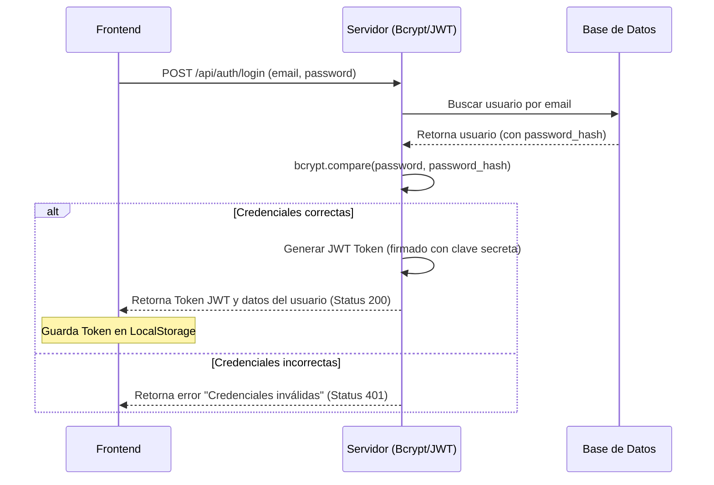

# 4. Servidor de Backend y API REST

Este documento describe la lógica de negocio, la seguridad y los puntos de entrada (endpoints) expuestos por el servidor de **FreelanceFlow CRM**. Se enfoca en explicar de manera sencilla cómo opera la API y cómo se asegura el flujo de datos.

---

## 1. Funcionamiento del Servidor Express

El backend es un servidor creado con **Node.js** y **Express.js** que escucha peticiones en el puerto `3000`. Su archivo principal es [app.js](file:///c:/Users/leove/OneDrive/Semestre%209%20DDMI/ProyectoWeb/ProyectoFreelanceCRM_02/backend/src/app.js) y realiza los siguientes pasos iniciales:

1.  **CORS (Cross-Origin Resource Sharing):** Habilita los permisos para que la página web (que corre localmente en el navegador) pueda hacerle consultas al servidor sin ser bloqueada por razones de seguridad.
2.  **Lectores de Cuerpo (Body Parsers):** Utiliza los middlewares `express.json()` y `express.urlencoded()` que traducen los datos que vienen en formato JSON desde el frontend en objetos JavaScript que el servidor pueda entender.
3.  **Rutas Base:** Mapea las URLs principales del sistema hacia sus respectivos archivos de ruta (`/api/auth`, `/api/clients`, `/api/projects`).
4.  **Sincronización con Base de Datos:** Llama a `sequelize.sync({ alter: true })`. Esta función lee los archivos de los modelos y crea de forma automática las tablas en el archivo `database.sqlite` si no existen, o las modifica si cambiamos algún campo.
5.  **Encendido:** Activa el servidor para que empiece a escuchar llamadas.

---

## 2. Flujo de Autenticación Seguro

El sistema cuenta con un flujo seguro para garantizar que cada freelancer acceda únicamente a sus propios clientes y proyectos.



### 2.1 Explicación de los Pasos de Seguridad
*   **Bcrypt:** Las contraseñas de los usuarios nunca se guardan en texto plano (legibles) en la base de datos. Cuando el usuario se registra o cuando usamos el inyector de datos de prueba (`seedUser.js`), la contraseña pasa por un proceso de hashing con Bcrypt que la transforma en un código encriptado irreversible. Al hacer login, Bcrypt compara la contraseña enviada con este código para validarla.
*   **JWT (JSON Web Token):** Si la contraseña es correcta, el servidor crea una firma digital llamada Token JWT. Este token incluye datos básicos del usuario (ID, nombre, correo) y expira en 24 horas. El frontend guarda este token en la memoria del navegador (`localStorage`) y lo utiliza para saber si el usuario tiene una sesión activa.

---

## 3. Catálogo de Rutas de la API (Endpoints)

A continuación se listan las URLs que el frontend puede consultar para interactuar con la información.

### 3.1 Rutas de Autenticación (`/api/auth`)
*   **`POST /api/auth/login` (Iniciar Sesión):**
    *   **Cuerpo enviado (JSON):**
        ```json
        {
          "email": "admin@freelanceflow.com",
          "password": "admin123"
        }
        ```
    *   **Respuesta Exitosa (Status 200):** Retorna un mensaje, el Token JWT generado y los datos públicos del usuario.

### 3.2 Rutas de Clientes (`/api/clients`)
*   **`GET /api/clients` (Obtener Clientes):** Obtiene todos los clientes. Puede filtrarse mediante la consulta `?user_id=ID_DEL_USUARIO` para obtener solo los clientes de un freelancer específico.
*   **`GET /api/clients/:id` (Obtener por ID):** Retorna la información de un cliente específico según su ID.
*   **`POST /api/clients` (Crear Cliente):** Crea un nuevo registro. Requiere obligatoriamente los campos `full_name` y `user_id`.
*   **`PUT /api/clients/:id` (Editar Cliente):** Modifica los campos del cliente según el ID indicado en la URL.
*   **`DELETE /api/clients/:id` (Eliminar Cliente):** Borra el registro de la base de datos.

### 3.3 Rutas de Proyectos (`/api/projects`)
*   **`GET /api/projects` (Obtener Proyectos):** Retorna todos los proyectos y realiza un cruce (JOIN) para traer también el nombre del cliente asignado. Permite filtrar por usuario actual usando `?user_id=ID_DEL_USUARIO`.
*   **`GET /api/projects/:id` (Obtener por ID):** Retorna el detalle de un proyecto específico.
*   **`POST /api/projects` (Crear Proyecto):** Crea un proyecto vinculándolo a un cliente. Requiere obligatoriamente `title` y `client_id`.
*   **`PUT /api/projects/:id` (Editar Proyecto):** Modifica la información del proyecto según su ID.
*   **`DELETE /api/projects/:id` (Eliminar Proyecto):** Elimina el proyecto del sistema.

---

## 4. Guía de Despliegue Local del Backend

Para levantar y ejecutar el servidor en tu entorno local por primera vez, sigue estos pasos en tu consola:

1.  **Instalar dependencias:** Navega a la carpeta `/backend` y ejecuta:
    ```bash
    npm install
    ```
2.  **Configurar variables de entorno:** Crea un archivo llamado `.env` en la raíz de la carpeta `/backend` y define la clave de seguridad del token:
    ```env
    PORT=3000
    JWT_SECRET=tu_clave_secreta_aqui
    ```
3.  **Inyectar usuario administrador de prueba (Seeding):** Para poder ingresar al sistema, ejecuta el script que inserta una cuenta de administrador inicial en la base de datos local SQLite:
    ```bash
    node src/utils/seedUser.js
    ```
    *Nota: Esto creará el usuario con el correo `admin@freelanceflow.com` y la contraseña `admin123`.*
4.  **Iniciar el servidor:** Enciende el backend en modo de desarrollo (el cual se reinicia automáticamente al guardar cambios en el código):
    ```bash
    npm run dev
    ```
